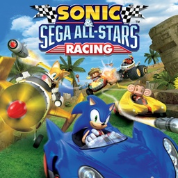

<div align="center">



# sonic_allstars_nx

**Sonic & SEGA All-Stars Racing on Nintendo Switch**

An unofficial Nintendo Switch wrapper for the Android version of
**Sonic & SEGA All-Stars Racing**.

[](#)
[](#)
[-3DDC84?style=for-the-badge&logo=android&logoColor=white)](#)

</div>

---

## About

`sonic_allstars_nx` is a native wrapper that runs the 32-bit ARM (armeabi)
Android build of **Sonic & SEGA All-Stars Racing** on Nintendo Switch. It loads
the game's own engine library, `libssasr.so`, and recreates the Android, JNI,
audio, input, networking and graphics services it expects under Horizon OS.
The wrapper itself runs as a 32-bit (AArch32) program, like the game's code.

This release targets **Sonic & SEGA All-Stars Racing 1.0.1** for Android
(`com.sega.ssasr`, versionCode 20, armeabi) and its expansion file
`main.20.com.sega.ssasr.obb`.

No game files are included. You need your own copy of the game: the APK and
its expansion file (or the zip the expansion file came in).

On top of the phone game, the port adds button controls in the style of the
console versions, 60 fps, 1080p docked, and split screen for two players
(Grand Prix, single race, battle and a two-player race).

---

## Controls

In races the port uses Mario Kart 8 Deluxe's layout. The touchscreen still
works in the menus.

| Input | Race | Menus |
| --- | --- | --- |
| **A** | Accelerate, skip the fly-by | Confirm |
| **B** | Brake, reverse | Back |
| **R / ZR** | Drift, trick in the air | Next page |
| **L / ZL** | Item, All-Star move | Previous page |
| **X** | Look behind | Extra button (rules, info) |
| **Y** | | Stats on the racer select |
| **Left Stick / D-Pad** | Steer, aim a thrown item | Move |
| **Right Stick** | | Pointer |
| **+** | Pause | Start |
| **Touchscreen** | | Menus in handheld mode |

Steering can use the controllers' motion sensors instead of the stick
(`steering` in `config.ini`).

Split screen is the main menu's **SPLIT SCREEN** card. It needs two
controllers: one Joy-Con each, held sideways, works.

---

## Build

### Requirements

* Docker
* The vita2hos devcontainer image (devkitARM, for the 32-bit program)
* [libnx32](https://github.com/aks796/libnx32) 4.12.0 or newer, the 32-bit
  libnx. `build.sh` mounts the `prefix/` of a libnx32 checkout next to this
  one (`../libnx32/prefix`); set `DCR_LIBNX32` to use another path.
* [mesa32](https://github.com/aks796/mesa32): its `lib/` and `include/`
  copied into `portlibs32/`.
* [ffmpeg32](https://github.com/aks796/ffmpeg32) (LGPL), built with the
  H.264, AAC and MP3 components (`FFMPEG_COMPONENTS`, see
  `portlibs32/README.md`): its `lib/` and `include/` copied into
  `portlibs32/` too.
* The `devkitpro/devkita64` image (for the launcher NRO)
* Python 3 and `pyelftools` (only for the host checks)

libnx32, mesa32 and ffmpeg32 have prebuilt releases, which work as well as
building them.

Compile the 32-bit program:

```bash
./build.sh
```

This produces `sonicracing_nx.nsp` and `sonicracing_nx.build` (its build
number). Then build the launcher, which carries the program in its RomFS:

```bash
launcher/build.sh
```

Or build everything and lay out the SD card in `SD_CARD/` and
`SD_CARD.zip`:

```bash
tools/package_sd.sh
```

Host checks, against your own files:

```bash
tools/test_host.sh /path/to/your.apk /path/to/your.obb
```

---

## Running

Requires Atmosphère and sphaira.

Create this folder on the SD card and put the NRO and your own game files in
it:

```text
sd:/switch/sonic_allstars_nx/
├── sonic_allstars_nx.nro
├── com.sega.ssasr-1.0.1.apk
└── main.20.com.sega.ssasr.obb
```

The file names do not matter. The APK is found by its contents, and so is
the expansion file, which may also be the `.zip` it came in. Nothing needs
unpacking.

1. In sphaira, open **Homebrew > Sonic & SEGA All-Stars Racing > Install
   Forwarder**.
2. Launch the new icon on the HOME menu.

The first launch installs the 32-bit program as the forwarder's ExeFS
override (`sd:/atmosphere/contents/<title id>/exefs.nsp`), restarts, and
unpacks `libssasr.so` from the APK. The game's data is read where it is.

Afterwards the folder looks like this:

```text
sd:/switch/sonic_allstars_nx/
├── sonic_allstars_nx.nro
├── com.sega.ssasr-1.0.1.apk
├── main.20.com.sega.ssasr.obb
├── config.ini
├── libssasr.so
├── classes.txt
├── data/
├── debug.log
└── debug.prev.log
```

Saves are in `data/files/`, player 2's in `data/p2/files/`. Settings live in
`config.ini`, which is written on the first launch and explains each option.

To update, replace `sonic_allstars_nx.nro`. The program installs the newer
build itself and restarts. To remove it from the icon, delete its
`exefs.nsp`.

Earlier versions used `sd:/switch/sonicracing/`. The first launch moves
everything in that folder (the APK, the data, `config.ini`, the saves) into
`sd:/switch/sonic_allstars_nx/`. The old `SonicRacing.nro` is left in place and
can be deleted.

---

## Status

Grand Prix, single races, the menus, music, sound, the intro movie and the
licences are working. Races run at 60 fps, 1080p docked and 720p handheld.
Time trial and missions use the same code and have had less testing.

Split screen supports Grand Prix and single races with the AI, battle, and a
race for two players. It runs a second copy of the engine for player 2.

Online services (Google Play Games, SEGA ID, the store, ads) are not
available. Everything is unlocked by default (`unlock_all` in `config.ini`).
The save itself is not changed.

The wrapper is built for **Sonic & SEGA All-Stars Racing 1.0.1** for Android.
Other versions have not been tested.

---

## Credits

**Sonic & SEGA All-Stars Racing Nintendo Switch port**: aks796

**Sonic & SEGA All-Stars Racing**: developed by Sumo Digital, published by
SEGA. The Android version was made by Distinctive Developments.

The loader derives from the open-source Android `.so` loader work by Andy
Nguyen (TheOfficialFloW) and fgsfds, with its 32-bit relocation handling
informed by [vita2hos](https://github.com/xerpi/vita2hos). The 32-bit runtime
is shared with the other 32-bit ports.

Built with devkitPro, devkitARM, libnx (AArch32 build from the vita2hos
toolchain), Mesa, FFmpeg (LGPL), miniz and stb_image. The button prompt
pictures use DejaVu Sans Bold.

---

## Contributing

Bug reports and tested improvements are welcome. Include the version, steps to
reproduce, and `debug.log`, `debug.prev.log` and `crash.log` from
`sd:/switch/sonic_allstars_nx/` when reporting an issue.

`NOTES.md` describes how the port works and what the 32-bit libraries needed.

---

## Disclaimer

This is an unofficial fan project and is not affiliated with, sponsored by or
endorsed by SEGA, Sumo Digital or Nintendo. Sonic & SEGA All-Stars Racing and
all related characters and trademarks belong to SEGA.

No game code or game data is included. You need your own copy of the game.
